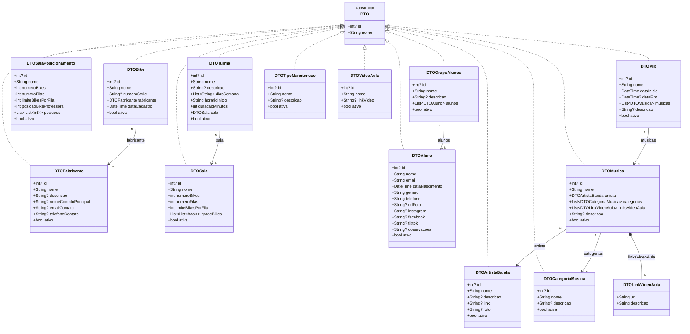

```mermaid
classDiagram
    direction TB

    class DTO {
        <<abstract>>
        +int? id
        +String nome
    }

    class DTOFabricante {
        +int? id
        +String nome
        +String? descricao
        +String? nomeContatoPrincipal
        +String? emailContato
        +String? telefoneContato
        +bool ativo
    }

    class DTOBike {
        +int? id
        +String nome
        +String? numeroSerie
        +DTOFabricante fabricante
        +DateTime dataCadastro
        +bool ativa
    }

    class DTOSala {
        +int? id
        +String nome
        +int numeroBikes
        +int numeroFilas
        +int limiteBikesPorFila
        +List~List~bool~~ gradeBikes
        +bool ativa
    }

    class DTOSalaPosicionamento {
        +int? id
        +String nome
        +int numeroBikes
        +int numeroFilas
        +int limiteBikesPorFila
        +int posicaoBikeProfessora
        +List~List~int~~ posicoes
        +bool ativo
    }

    class DTOTurma {
        +int? id
        +String nome
        +String? descricao
        +List~String~ diasSemana
        +String horarioInicio
        +int duracaoMinutos
        +DTOSala sala
        +bool ativo
    }

    class DTOAluno {
        +int? id
        +String nome
        +String email
        +DateTime dataNascimento
        +String genero
        +String telefone
        +String? urlFoto
        +String? instagram
        +String? facebook
        +String? tiktok
        +String? observacoes
        +bool ativo
    }

    class DTOGrupoAlunos {
        +int? id
        +String nome
        +String? descricao
        +List~DTOAluno~ alunos
        +bool ativo
    }

    class DTOArtistaBanda {
        +int? id
        +String nome
        +String? descricao
        +String? link
        +String? foto
        +bool ativo
    }

    class DTOCategoriaMusica {
        +int? id
        +String nome
        +String? descricao
        +bool ativa
    }

    class DTOLinkVideoAula {
        +String url
        +String descricao
    }

    class DTOMusica {
        +int? id
        +String nome
        +DTOArtistaBanda artista
        +List~DTOCategoriaMusica~ categorias
        +List~DTOLinkVideoAula~ linksVideoAula
        +String? descricao
        +bool ativo
    }

    class DTOMix {
        +int? id
        +String nome
        +DateTime dataInicio
        +DateTime? dataFim
        +List~DTOMusica~ musicas
        +String? descricao
        +bool ativo
    }

    class DTOTipoManutencao {
        +int? id
        +String nome
        +String? descricao
        +bool ativa
    }

    class DTOVideoAula {
        +int? id
        +String nome
        +String? linkVideo
        +bool ativo
    }

    %% Herança - todos implementam DTO
    DTO <|.. DTOFabricante
    DTO <|.. DTOBike
    DTO <|.. DTOSala
    DTO <|.. DTOSalaPosicionamento
    DTO <|.. DTOTurma
    DTO <|.. DTOAluno
    DTO <|.. DTOGrupoAlunos
    DTO <|.. DTOArtistaBanda
    DTO <|.. DTOCategoriaMusica
    DTO <|.. DTOMusica
    DTO <|.. DTOMix
    DTO <|.. DTOTipoManutencao
    DTO <|.. DTOVideoAula

    %% Associações
    DTOBike "N" --> "1" DTOFabricante : fabricante

    DTOTurma "N" --> "1" DTOSala : sala

    DTOGrupoAlunos "1" --> "N" DTOAluno : alunos

    DTOMusica "N" --> "1" DTOArtistaBanda : artista
    DTOMusica "1" --> "N" DTOCategoriaMusica : categorias
    DTOMusica "1" *-- "N" DTOLinkVideoAula : linksVideoAula

    DTOMix "1" --> "N" DTOMusica : musicas
```
